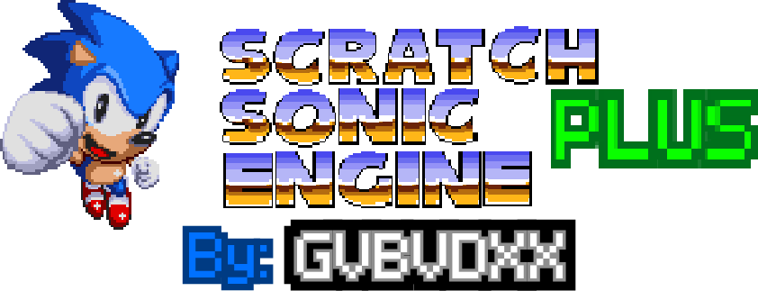
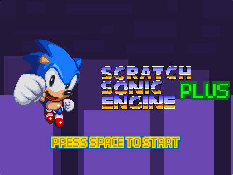
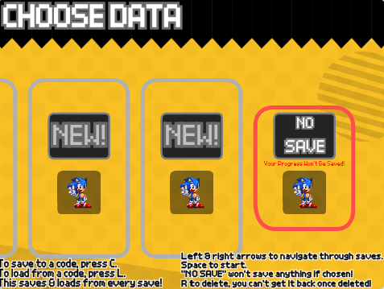
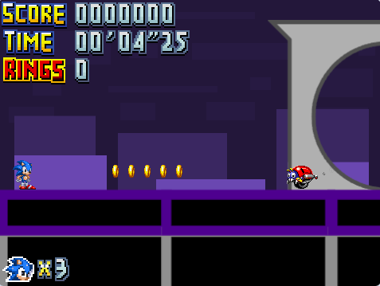

## 🦔 Scratch Sonic Engine PLUS

> [!IMPORTANT]
> This project is technically not beta anymore, but still may change A lot.
> So you might have to merge manually (which you'll probably have to figure out yourself) or just live without some future features.

Welcome to the Scratch Sonic Engine PLUS repository!
There is no code inside the repository, you need to check the [releases page](https://github.com/gvbvdxxalt2/ScratchSonicEnginePlus) to get the source code.

### ✨ Features

* 🏃 Close-to-accurate Classic Sonic physics - Run up walls, slopes, and launch yourself off curves! Feels just like you're playing the real game!
* ⚙ Easy configuration - Using the `Configuration` sprite, you can edit in your own levels easily.
* 📝 Save states & codes - You can now save your saves into codes by pressing P in the level to leave into the save select.
* 🎮 Entire framework for an Sonic fangame - It has everything you need! Not just a singular level with Sonic running on black squares and lines.

### 🎮 How to play & edit 🛠

You'll need to download a SB3 release from the [releases page](https://github.com/gvbvdxxalt2/ScratchSonicEnginePlus).

Open the [Scratch editor](https://scratch.mit.edu/projects/editor), [TurboWarp](https://turbowarp.org), or other mods, and just open the SB3 file. (Usually called `Load from your computer`)

Thats it!

### 🕹 Basic Controls

| Button | Action |
| :--- | :--- |
| Arrow Keys | Navigate menus, or control your character |
| Z key | Makes your character jump |
| Space | Start on title screen and save select |
| P key | Exits the level |
| R key | Resets the selected save data in save select |

### 🛠🕹 Debug Controls

> [!IMPORTANT]
> Debug Mode is only in level, and also can be turned off in the `Configuration` sprite.
> We're sure it should work in our releases.

| Button | Action |
| :--- | :--- |
| C + D keys | Toggle debug mode |
| Arrow Keys | Fly around |
| A key + Arrow Keys | Fly around faster |
| C key + Arrow Keys | Fly around slowly (1 pixel per frame) |
| D key | Rotate |
| Z key | Place object |
| X key | Cycle through objects |

### ⚙ Recommended settings

If you're using a modified [Scratch editor](https://scratch.mit.edu/projects/editor) such as TurboWarp (link listed above), you'll probably have some custom settings set, here are the recommended settings for the best experience.

| Setting | Value | Reason |
| :--- | :--- | :--- |
| Stage width & height | 480x360 | Scratch Sonic Engine PLUS was made for compatibility with Scratch and is tied to this resolution. |
| Infinite Clones | on | Objects and the level itself are clones, you should keep this off if you need full compatibility with plain Scratch. |
| Disable Sprite Fencing | off | Scratch Sonic Engine PLUS uses this to detect when things are off screen, if you turn this on, everything would be active at once in the level and make the game laggy and slow, so its best to keep this off. |

### 🐱⬆ Reupload policy

In order to reupload without reports or getting flagged, you MUST follow this policy:

* Give full credit to me and the project name - You must put `@gvbvdxx` and the project name, you can thank or credit me however you want, as long as you include both names. Example: `Thanks @gvbvdxx for creating Scratch Sonic Engine PLUS! This whole game wouldn't have been possible without it.`
* Give the GitHub url - You also must include the GitHub URL to avoid confusion for people also trying to use the engine, the GitHub URL is `https://github.com/gvbvdxxalt2/ScratchSonicEnginePlus`.
* Avoid editing the `By: Gvbvdxx (Intro)` sprite - For people who forget to add the stuff above, this is the bare minimum for what you can have. If you forget to add the stuff above, it at least shows you've used Scratch Sonic Engine PLUS.

> [!IMPORTANT]
> If you haven't known, I've been banned from the [Scratch](https://scratch.mit.edu) community permanently.
> You can read all about it [here on my domain](https://gvbvdxx.me).
> Scratch may hide your projects from the search if you include my username, but it doesn't mean to not follow the policy above.

### 📜 Legal disclaimer

> [!IMPORTANT]
> This is a non-profit fan-made engine.
> This project must NOT be sold or used for commercial purposes.
> All Sonic the Hedgehog characters, assets, and music are trademarks of SEGA® and Sonic Team®.
> This is a tribute to their work.

### 📖 Credits

* SEGA® and Sonic Team® - Classic Sonic physics inspired by Sonic Mania & Sonic Superstars. Sounds are dumped from Sonic Mania.
* Sonic, Tails, & Knuckles Sprites - The Mod.Gen Project & [Re-Done Classic Knuckles Sprites](https://scratch.mit.edu/projects/114767499/) (By [`@MunchJrGames`](https://scratch.mit.edu/users/MunchJrGames/))

### 🌴 Zones

* Test Chamber Alpha
* Template Level (Scratch Sonic Engine original throwback)
* Rapid Beach (Scratch Sonic Engine original throwback)

### 🖼 Screenshots

Might be outdated and might look differently compared to recent versions.

